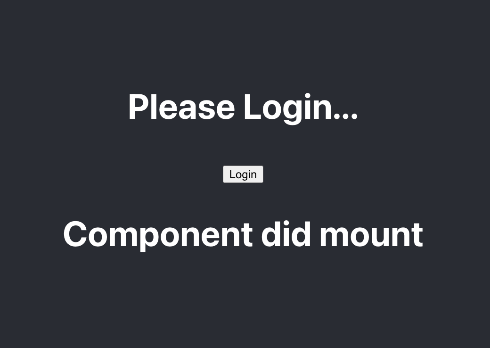
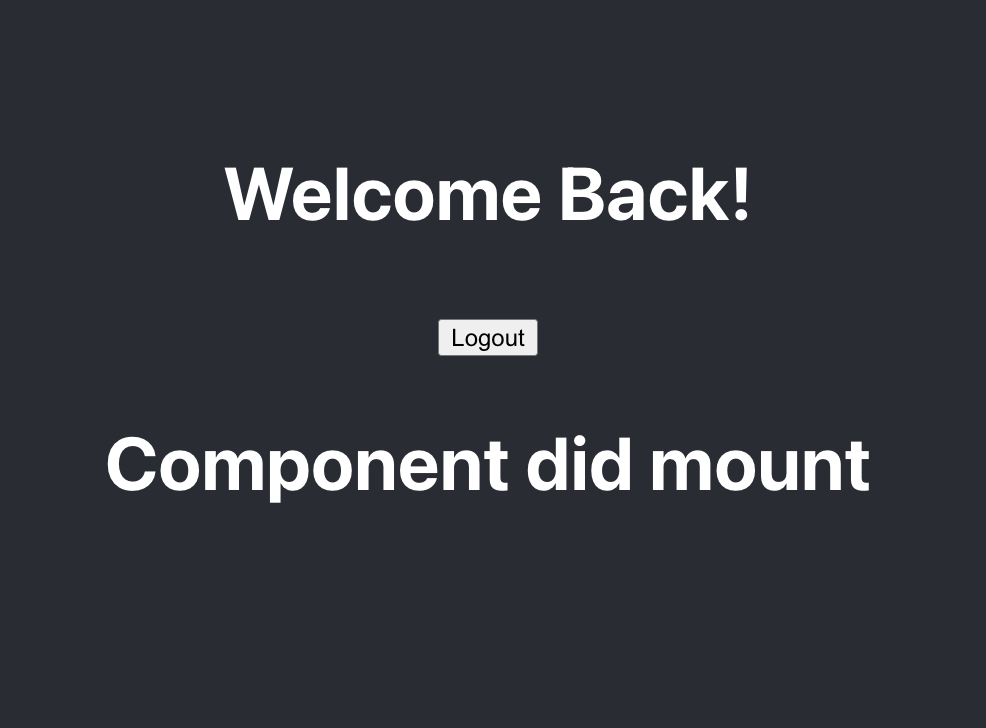

# Learning Hooks

Boca Code Week 5 Learning React Hooks:  We focused on learning practicing React hooks. React hooks are functions that allow us to use state and other React features in functional components. In this project, we explored the usage of two popular React hooks: `useState` and `useEffect`.

## Project Structure

The project consists of the following components:

- **App.js**: The main component that renders the app.
- **Login.js**: Renders a login section with a login button. Changes the UI based on the user's login status using the `useState` hook.
- **Message.js**: Displays a message that changes when the component mounts using the `useEffect` hook.

## Technologies Used

- Javascript
- CSS
- React

## Getting Started

To run the project locally and explore React hooks in action, follow these steps:

1. Clone the repository from [GitHub](https://github.com/[repository-url]).

2. Install the necessary dependencies using `npm install`.

3. Run the app using `npm start`.

## Usage

Once the app is running, you will see a login section with a login button. Clicking the login button will update the UI to display a welcome message. Clicking the logout button will revert the UI back to the login section. The message component will display different messages based on the component's lifecycle using the `useEffect` hook.

## Special Thanks

Special thanks to [Boca Code](https://github.com/bocacode) for providing the learning environment.

---
*This project was developed as part of the Boca Code curriculum.*
